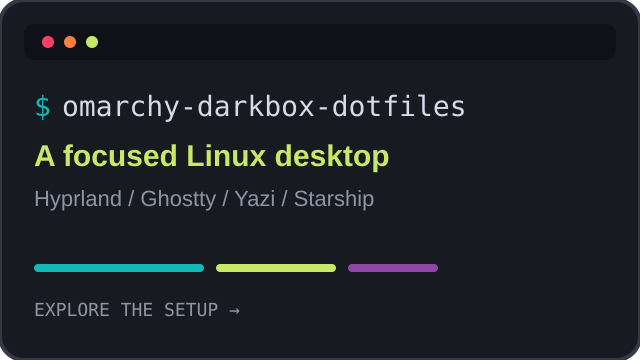
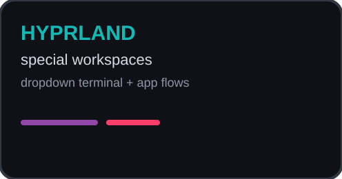
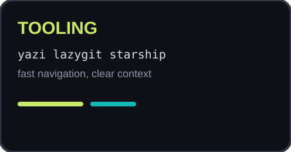
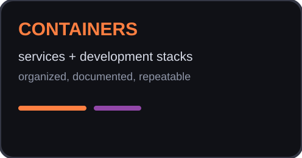

  

  <strong>Linux workflows designed for focus.</strong> 
  Omarchy, Hyprland, terminal tooling, containers, and practical automation.

  

<h2 align="center">The Darkbox setup</h2>

  
  
  

  <a href="https://github.com/darkstardevx/omarchy-darkbox-dotfiles">Dotfiles</a>
  &nbsp;&middot;&nbsp;
  <a href="https://github.com/darkstardevx/omarchy-darkbox-dotfiles/tree/main/dotfiles-docs">Documentation</a>
  &nbsp;&middot;&nbsp;
  <a href="https://github.com/darkstardevx/omarchy-darkbox-dotfiles/tree/main/Scripts">Scripts</a>
  &nbsp;&middot;&nbsp;
  <a href="https://github.com/darkstardevx/omarchy-darkbox-dotfiles/tree/main/Projects">Projects</a>

<h2 align="center">Selected public projects</h2>

  <strong>Core &amp; platform</strong> 
  <a href="https://github.com/darkstardevx/cybercore">cybercore</a>
  &nbsp;&middot;&nbsp;
  <a href="https://github.com/darkstardevx/cyberplug">cyberplug</a>
  &nbsp;&middot;&nbsp;
  <a href="https://github.com/darkstardevx/apexdaemon">apexdaemon</a>

  <strong>Security &amp; networking</strong> 
  <a href="https://github.com/darkstardevx/wraithflow">wraithflow</a>
  &nbsp;&middot;&nbsp;
  <a href="https://github.com/darkstardevx/cybermeta">cybermeta</a>
  &nbsp;&middot;&nbsp;
  <a href="https://github.com/darkstardevx/vortexwall">vortexwall</a>
  &nbsp;&middot;&nbsp;
  <a href="https://github.com/darkstardevx/ghostport">ghostport</a>
  &nbsp;&middot;&nbsp;
  <a href="https://github.com/darkstardevx/gateflow">gateflow</a>

  <strong>Developer tools</strong> 
  <a href="https://github.com/darkstardevx/diagprint">diagprint</a>
  &nbsp;&middot;&nbsp;
  <a href="https://github.com/darkstardevx/cyberterm">cyberterm</a>

  
    Systems intelligence &nbsp;·&nbsp; secure tooling &nbsp;·&nbsp; focused workflows
  

<h2 align="center">Palette</h2>

  <code>#14B9B5</code> cyan &nbsp;
  <code>#C8E967</code> lime &nbsp;
  <code>#9147A8</code> purple &nbsp;
  <code>#FD3E6A</code> pink &nbsp;
  <code>#FF7F41</code> orange

  Built around Omarchy and shaped for the Darkbox workflow.

