

  

  <strong>Systems intelligence for the dark edge.</strong> 
  A connected collection of Rust systems, secure networking tools, Omarchy extensions, 
  and operator-focused workflows built on the <strong>Cybercore</strong> foundation.

  

<h2 align="center">◆ The Cybercore systems framework</h2>

  Cybercore is the single source of truth for shared schemas, canonical paths, 
  design tokens, and the CYBERGRID palette used across the ecosystem.

  

<h2 align="center">◆ Public project matrix</h2>

  

<a href="https://github.com/darkstardevx/cybercore">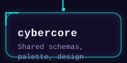</a><a href="https://github.com/darkstardevx/cyberdeck">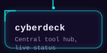</a><a href="https://github.com/darkstardevx/cyberplug">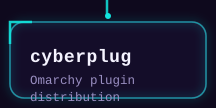</a> <a href="https://github.com/darkstardevx/apexdaemon">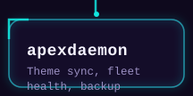</a>

  

<a href="https://github.com/darkstardevx/wraithflow">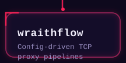</a><a href="https://github.com/darkstardevx/cybermeta">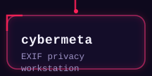</a><a href="https://github.com/darkstardevx/vortexwall">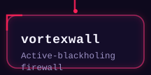</a> <a href="https://github.com/darkstardevx/cybervault">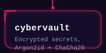</a><a href="https://github.com/darkstardevx/gateflow">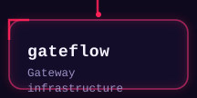</a>

  

<a href="https://github.com/darkstardevx/diagprint">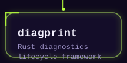</a><a href="https://github.com/darkstardevx/cyberterm">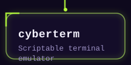</a>

<h2 align="center">◆ CYBERGRID palette</h2>

  
  
  
  
  
  

  <a href="https://github.com/darkstardevx/cybercore"><strong>Explore Cybercore →</strong></a>
  &nbsp;&nbsp;·&nbsp;&nbsp;
  <a href="https://github.com/darkstardevx/omarchy-darkbox-dotfiles"><strong>Explore the private Darkbox workspace →</strong></a>

